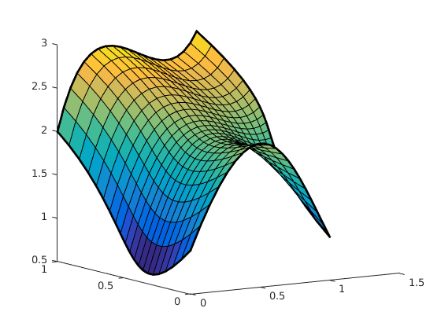
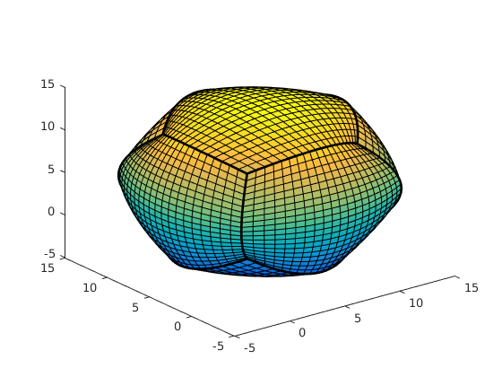

# Coons-Patch
A Matlab interpolation project, made in team with Maxime Quentin during my 2nd year at the ENSEEIHT.

The idea is to build Coons Patches with Matlab.

The code and the report are written in french.

